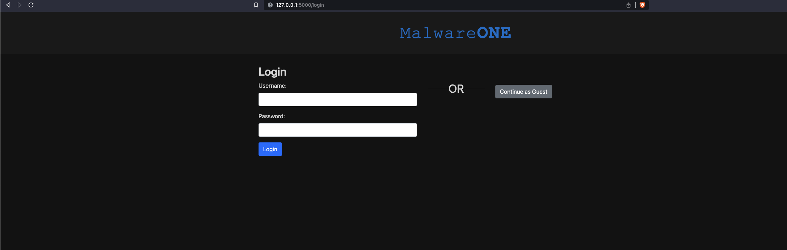
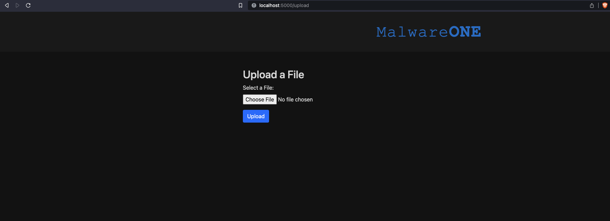
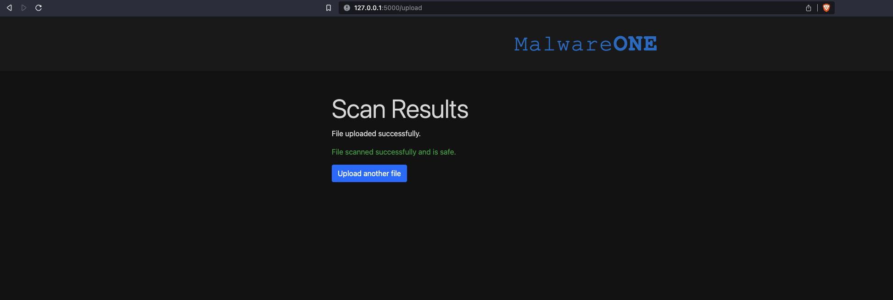
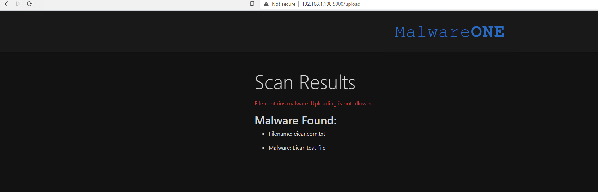

# FSS SDK App Quick Launch

This is a simple Flask web application that demonstrates how to scan uploaded files for malware using Trend Micro's Vision One File Security **Python SDK.** 

It allows you to upload files for scanning, and if malware is detected, it will display the scan results.


## Getting Started

### 1. Clone the Repository

```bash
git clone https://github.com/JustinDPerkins/vision-fun.git
cd vision-fun/fs-sdk-app
```

### 2. Help Complete the App to include V1 File Security Python SDK.

### 3. Build and Run the contianer. Its expecting port 5000 to be used.

### 4. Access the application

Open your web browser and navigate to http://localhost:5000 to access the application.

FYI: The login page is not recording user data please just select "Continue as guest". Authentication and storing data will be available in the next version of this application.



### 5. Upload a file

This is the upload page:



This is an example of a non-malicious file being uploaded: 



This is an example of a malicious file being uploaded: 

